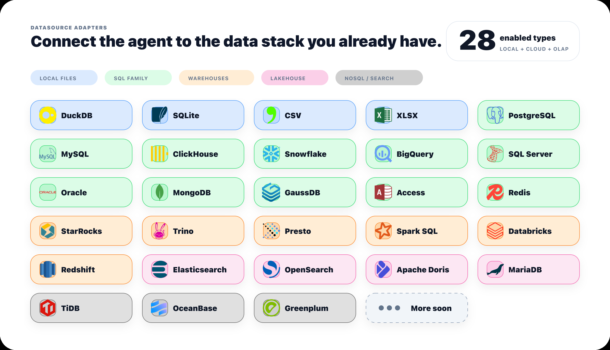
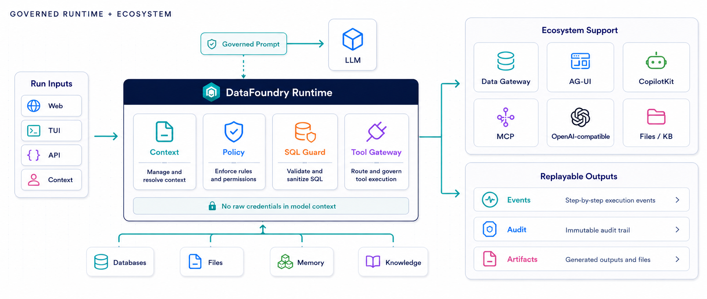
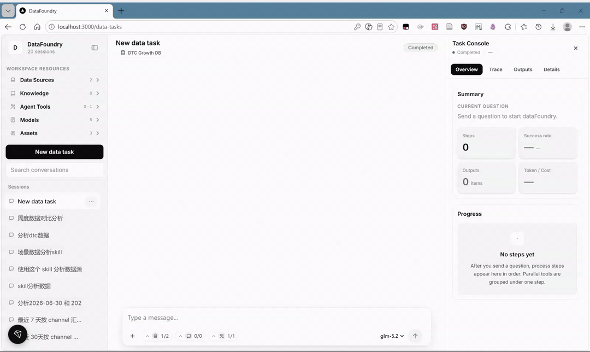
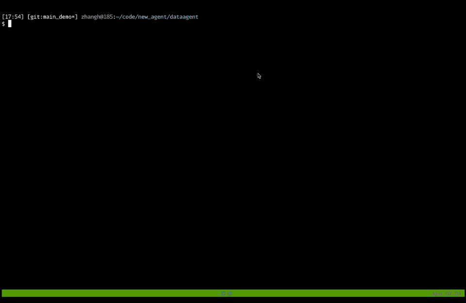

<h1 align="center">DataFoundry 🚀</h1>

<p align="center">
  一个 TypeScript 数据 Agent 运行时与工作台，用自然语言连接数据源、文件、知识库和分析产出。
</p>

<p align="center">
  <a href="README.md">English</a> · 简体中文
</p>

<p align="center">
  <a href="docs/zh/quick-start.md"><strong>快速开始</strong></a>
  ·
  <a href="docs/zh/README.md"><strong>中文文档</strong></a>
  ·
  <a href="docs/zh/reference/supported-datasources.md"><strong>支持的数据源</strong></a>
  ·
  <a href="#-参与贡献"><strong>参与贡献</strong></a>
  ·
  <a href="#-许可证"><strong>许可证</strong></a>
</p>

## 为什么用 DataFoundry

DataFoundry 面向本地试用、开源集成和数据分析工作台开发。你可以用它连接数据库或文件，让 Agent 先检查 schema，再执行只读查询，并把 SQL、步骤、结果表格、图表和报告留在可追溯的运行记录里。

核心能力：

- **先看结构再查询**：Agent 在执行 SQL 前检查数据源结构，减少字段猜测。
- **只读数据边界**：Data Gateway 负责连接、SQL guard、行数限制、超时和审计。
- **可回放运行过程**：后端持久化 AG-UI 事件、工具调用、产出和会话历史。
- **统一文件与产出**：上传文件、工作区文件、知识库导入和 Agent 产出共用文件资产层。
- **Web 与 TUI 共用后端**：图形工作台和终端界面都走同一套运行时、配置 API 和事件流。

## 数据源范围

DataFoundry 通过 Data Gateway 适配数据源。内置 DuckDB demo 适合首次体验；SQLite、CSV、Excel、PostgreSQL 和 MySQL 适合本地试用和常见验证；云数仓、搜索引擎和 NoSQL 类型需要对应服务、网络和凭据。

<p align="center">
  
</p>

## 运行方式

<p align="center">
  
</p>

客户端把问题和本次运行配置发给后端。后端合并工作区默认值、本次选择和服务端策略，然后创建 Agent run。模型只能看到受控上下文；数据库密码、模型 API Key 和 MCP Token 不进入 `messages`、`context` 或 `forwardedProps`。

## GUI 演示

下面是真实 Web 工作台界面的录屏，展示当前图形界面的使用体验。

<p align="center">
  
</p>

## TUI 演示

下面是真实终端界面的录屏，展示 TUI 连接后端运行时后的交互过程。

<p align="center">
  <a href="docs/assets/readme/tui-demo.mp4">
    
  </a>
</p>

## 快速开始

```bash
npm install
cp .env.example .env
cp apps/web/.env.example apps/web/.env.local
npm run dev
```

打开 Web 工作台：

```text
http://127.0.0.1:3000/data-tasks
```

配置模型：

```text
LLM_PROVIDER=openai-compatible
LLM_MODEL=qwen-plus
LLM_BASE_URL=https://dashscope.aliyuncs.com/compatible-mode/v1
LLM_API_KEY=replace-with-your-key
```

DeepSeek 和其他 OpenAI-compatible 服务使用同一种 provider 模式：

```text
LLM_PROVIDER=openai-compatible
LLM_MODEL=deepseek-chat
LLM_BASE_URL=https://api.deepseek.com
LLM_API_KEY=replace-with-your-key
```

首次体验不需要准备数据库。工作台内置 DuckDB demo 数据源，配置模型后可以直接提问：

```text
帮我查看数据源里有哪些表，并说明每张表的主要字段。
```

## 你可以用它做什么

| 场景 | DataFoundry 提供什么 |
| --- | --- |
| 自然语言数据分析 | 数据源选择、schema 检查、只读 SQL、查询限制、审计日志、表格产出。 |
| 文件辅助分析 | 对话附件、工作区文件、下载、复用和生成文件管理。 |
| 知识库增强 | 文档集合、分块、检索边界和带引用的上下文注入。 |
| Agent 前端开发 | CopilotKit / AG-UI 流式事件、任务状态、工具调用、运行回放和产出展示。 |
| 受控工具扩展 | MCP Server、Skill package、workspace tools 和后端工具策略。 |

## 开发命令

```bash
npm run build
npm run smoke:config-api
npm run smoke:data-gateway
npm run smoke:copilotkit
npm run smoke:docs
```

改动文档后运行 `npm run smoke:docs`。改动运行时、配置 API 或前端工作台时，再运行对应 smoke 检查。

## 进展与路线图

- [ ] **语义数据操作层**：沉淀指标、实体、关联、血缘、策略和可复用分析概念，形成稳定的业务语义层。
- [ ] **自主分析循环**：让 Agent 能规划分析、执行受控实验、审视结论，并收敛到有证据支撑的结果。
- [ ] **评测与可靠性实验室**：建设 NL2SQL、检索、工具调用和端到端任务基准，支撑回归门禁和失败分析。
- [ ] **多模态知识织网**：把表格、文档、Notebook、图表、图片、日志和生成文件统一纳入受控上下文与检索体系。
- [ ] **Agent 应用平台**：支持面向行业场景的分析 Agent、可复用工作流、自定义工具和可分享 Agent 应用。
- [ ] **企业控制平面**：补齐身份、RBAC、审批、审计导出、策略即代码、成本限制和部署运维能力。

### 近期进展

- **2026-07-01：DataFoundry 首个完整版本**：DataFoundry 已经形成一套完整的受控 AI 数据工作台：Web 工作台与 TUI 共用 TypeScript Agent Runtime、CopilotKit / AG-UI 事件流、可回放运行历史、任务状态、SQL 审计、artifact 产出和统一文件资产层。首版能力已经覆盖自然语言分析、数据源注册、连接测试、schema 抓取、表预览、只读 SQL、行数限制、字段脱敏、知识库导入、workspace 文件、MCP 资源、Skill package、内置 data-analysis skill 和模型配置。它不再只是一个 Agent demo，而是一套面向安全、可追溯、可复用数据分析工作的 Data Agent 操作底座。

## 中文文档

| 你要做什么 | 阅读 |
| --- | --- |
| 本地跑通 demo | [快速开始](docs/zh/quick-start.md) |
| 了解产品边界 | [产品概览](docs/zh/overview.md) |
| 查看 Web、TUI、API 能力 | [能力全览](docs/zh/capabilities.md) |
| 使用图形工作台 | [Web 工作台指南](docs/zh/guides/web-workbench.md) |
| 使用终端界面 | [TUI 指南](docs/zh/guides/tui.md) |
| 接入数据源 | [数据源指南](docs/zh/guides/data-sources.md) |
| 查看支持的数据源 | [支持的数据源](docs/zh/reference/supported-datasources.md) |
| 对接 HTTP API | [REST API 参考](docs/zh/reference/rest-api.md) |
| 理解 Agent run | [Agent Runtime 与 AG-UI 参考](docs/zh/reference/agent-runtime.md) |
| 理解架构 | [架构概览](docs/zh/architecture/overview.md) |
| 检查安全边界 | [安全说明](docs/zh/security.md) |

## 参与贡献

1. 行为、协议、数据源适配器和 Agent 策略变更，请先开 issue 或 discussion。
2. Pull request 聚焦一个运行时边界或功能区。
3. 提交前运行 `npm run build` 和你改动区域对应的 smoke 检查。
4. 改动 setup、API、数据源配置、事件行为或用户可见输出时，同步更新中文文档。
5. 不提交凭据、本地数据库、生成的 storage 或私有 benchmark 数据。

## 状态

DataFoundry 仍在开发。以当前代码、公开文档和 smoke 检查结果为准。生产级多租户鉴权、集中式 Secret 管理、监控和部署运维需要单独评估。

## 许可证

Apache License 2.0。见 [LICENSE](LICENSE)。
